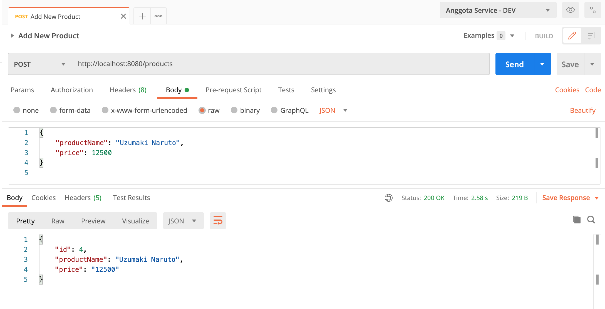
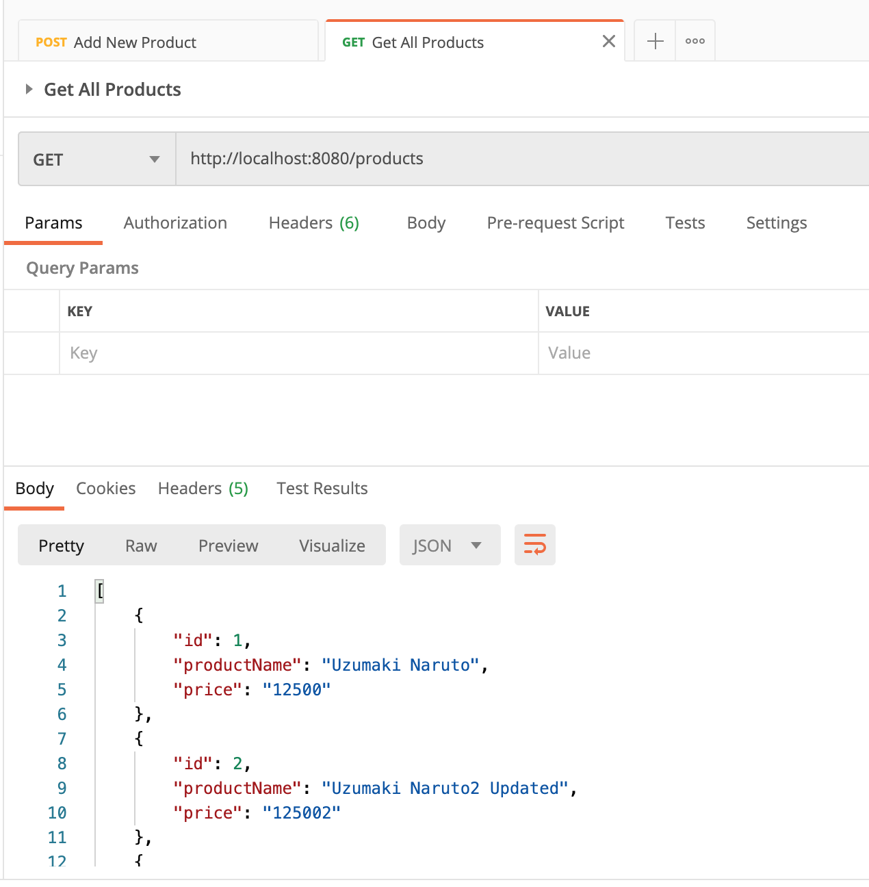
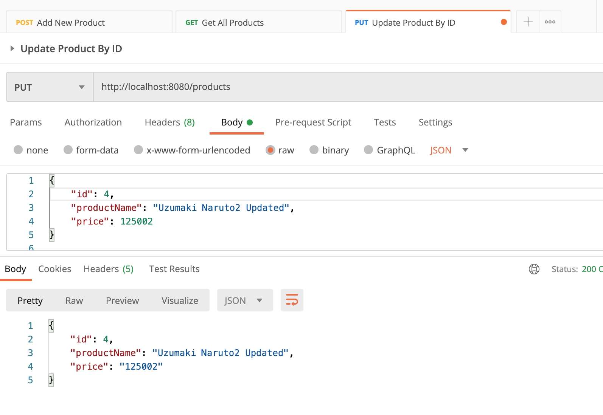
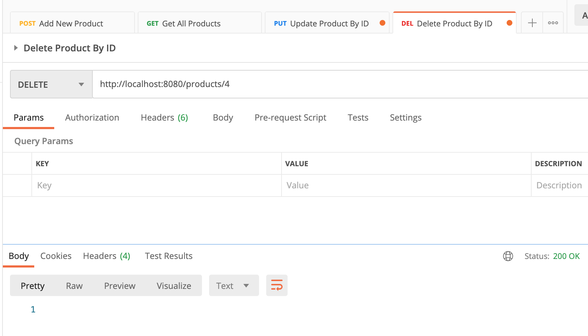

# Spring Boot App & Angular 10 Web App with DigitalOcean Deployment

## Things to do list

1. Clone this repository: `cd https://github.com/hendisantika/springboot-angular-digitalocean-deployment.git`
2. Go inside the folder: `cd springboot-angular-digitalocean-deployment`
3. Go inside Backend Service the folder: `cd product-service`
4. Run the application via docker-composer: `docker-compose up`
5. Import POSTMAN Collection file

## Images Screen shot

Add New Product

List All Products

Update Product by ID

Delete Product By ID

